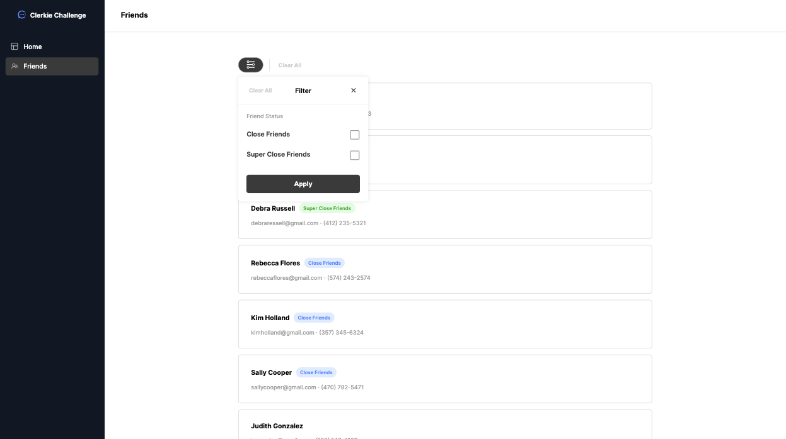
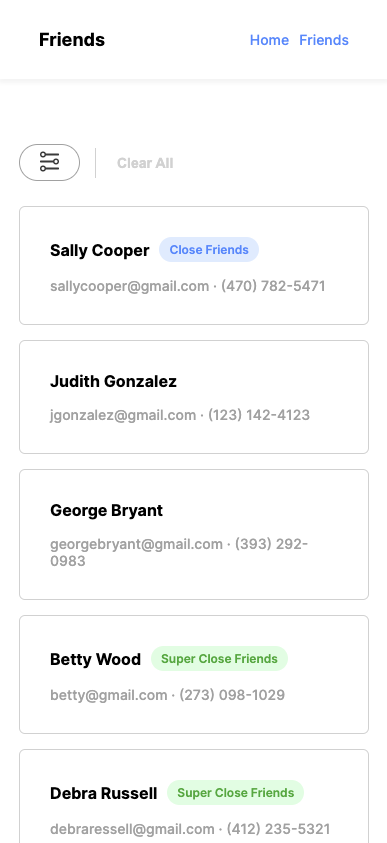

# [Clerkie Friends Challenge](https://friends-challenge.vercel.app/)

[Deployed Application](https://friends-challenge.vercel.app/)

  
  

## Requirements

- Implement the Figma designs exactly
- Build the site with no external dependencies besides those provided in Next.js starter project
- Create an infinite scroll on friends page
- Create filter functionality on friends page
- Should be able to clear all filters and clear all selected filters within the form
- Extras:
  - Add fade animations to the loader components
  - Route to a single friend view screen

## Usage

Install:
`npm install`

Run in dev mode:
`npm run dev`

Build:
`npm run build`

Run in production mode:
`npm run start`

## Technologies

- React
- Next.js
- Vercel
- CSS Modules
- [Intersection Observer API](https://developer.mozilla.org/en-US/docs/Web/API/Intersection_Observer_API)

## Architecture

Theme:

- Theme handled using CSS module variables
- components will handle their own styles
- globals defined in styles directory

Structure:

- /components
  - each component has own directory and css module
  - components follow atomic design principals but are not separated into atoms/molecules/organism directories for simplicity
    - atoms: Button, Text, Card, Chip, Error, Loader, NavItem
    - molecules: Checkbox, FilterForm, FriendCard, FriendsList, LoaderCard, NavBar, NavMenu
    - organisms: FilterFormContainer, PageTemplate, SideNav
- /pages
  - /home: - no logic
  - /friends
    - data fetched client side to implement pagination and loading states
    - filters logic held in page component to be passed to FilterForm and FriendsList
    - friends and pagination logic held in page component
    - custom useFriends hook to handle logic
  - /friends/[slug]
    - data fetched and page statically generated at build time using getStaticPaths and getServerSideProps to use the power of Next :rocket:
  - 404.js - custom 404 page
  - 500.js - custom 500 page
- /hooks
  - separate complex logic within components into custom hooks
- /icons
  - svg icons are handled as components to incorporate theme
- /mocks - friends data
- /constants - page links, friend levels, viewports
- /styles
  - CSS module variables defined in styles/globals.css
  - global classes are defined in styles/globals.module.css

## Todo

- [x] Set up theme variables
- [x] Build components
- [x] Icon components
- [x] Build home page
- [x] Build friends page
- [x] Set up mock API routes to handle pagination
- [x] Set up pagination on friends page
- [x] Implement infinite scroll
- [x] Add filter functionality
- [x] Mobile responsiveness
- [x] Build single friend view page
- [x] Animate loader
